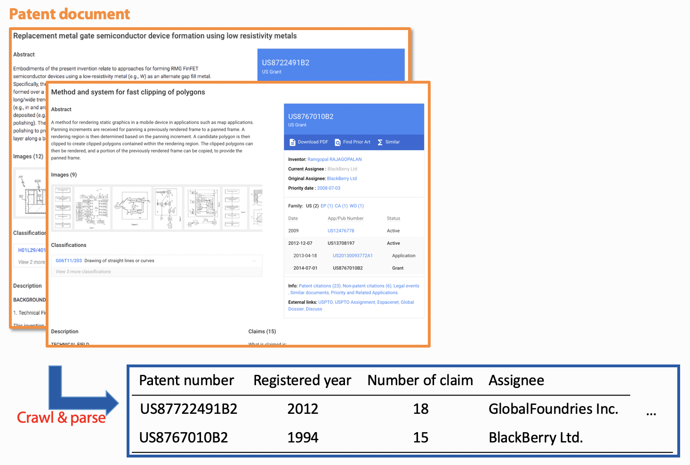

# google-patent-crawler-parser
Python implementation of google patent crawler and parser
***

Description
-----------
This code crawls patent documents of interest from [https://patents.google.com](https://patents.google.com), and parse them into a strutured database in the form of .csv file.

Prerequisites
-------------
1. Python (the codes in this repository are developed using Python verison 3.6.6)
2. You need several external packages, and they are mentioned in the python file.

